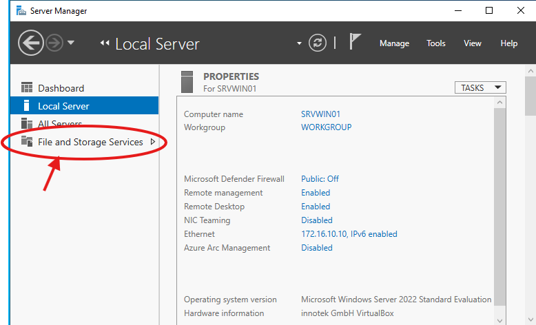
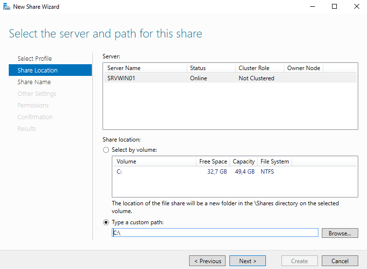
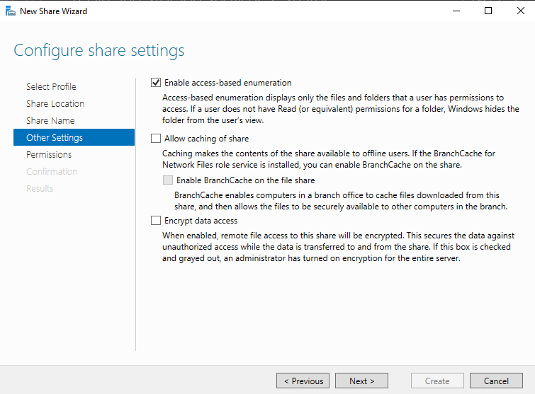
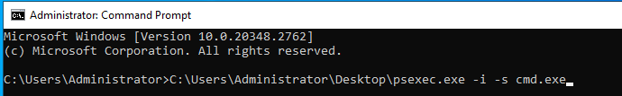
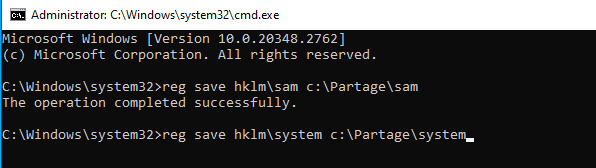

# DOCUMENTATION ADMINISTRATEUR 

## Prérequis techniques

1. **Connaissances minimales** à travailler sur un terminal sous Linux
  
2. **Un serveur** :  
Windows server 2022, identifié SRVWIN01, sous le compte: Administrator avec le mot de passe Azerty1* et l'adresse IP fixe: 172.16.10.10 en masque sous-réseau: 255.255.255.0.
  
3. **Un client** :  
Sous Ubuntu 22.04, identifié CLILIN01, sous le compte utilisateur: wilder avec le mot de passe Azerty1* et l'adresse IP fixe: 172.16.10.20 en masque sous-réseau: 255.255.255.0.
  
4. **Systèmes d'exploitation supportés** :  
Linux/Unix : John the Ripper a été initialement conçu pour fonctionner sur ces systèmes (Ubuntu, Debian, Fedora, etc.).
Windows : Il existe des versions adaptées pour Windows, mais l'utilisation est souvent plus fluide sous Linux.
macOS : Il peut être utilisé avec les bons outils de compilation.
  
5. **Dépendances** :  
Compilateur : Si vous compilez à partir du code source, vous aurez besoin d’un compilateur comme ```gcc``` sur Linux ou Xcode sur macOS. Sur Windows, il peut nécessiter ```Cygwin``` ou ```MinGW```.
OpenSSL : Pour les algorithmes de hachage spécifiques, l'outil peut s'appuyer sur OpenSSL.
Git : Si vous téléchargez la version depuis le dépôt GitHub.
  
6. **Matériel** :  
Processeur multicœur : John the Ripper est capable de tirer parti de plusieurs cœurs CPU.
GPU (optionnel) : Des versions comme John the Ripper Jumbo supportent l’utilisation de GPU via OpenCL ou CUDA pour accélérer le craquage de mots de passe.
RAM : Plus vous avez de RAM, plus vous pouvez gérer des fichiers de hachage volumineux.
  
7. **Versions spécifiques** :  
John the Ripper standard : Pour les besoins basiques de test de mots de passe.
John the Ripper Jumbo : Cette version est enrichie de nombreux patchs et supporte un plus grand nombre d'algorithmes et de formats de fichiers (MD5, SHA-1, NTLM, etc.).
  
8. **Algorithmes supportés** :  
MD5, SHA-1, SHA-256, bcrypt, DES, NTLM, Kerberos, et bien d’autres.
  
9. **Accès à un fichier de hachage** :  
John the Ripper ne fonctionne pas directement sur des mots de passe en clair mais sur des fichiers contenant des hashs (comme /etc/shadow sous Linux, ou des dumps de bases de données).
  
10. **Commandes de base** :  
Il faut connaître les commandes en ligne de John the Ripper pour craquer les mots de passe, lancer des attaques par dictionnaire ou par force brute (allez voir [USER_GUIDE](https://github.com/WildCodeSchool/TSSR-2409-JAUNE-P1-G3-SecurisationDeMotDePasse/blob/261dd6862f5507e3f5004c169266dd713303b90c/USER_GUIDE.md)).
  
---
## Installation et configuration 

### -*Installation* 
1. **Mise à jour du système**  
Avant d'installer un nouveau logiciel, il est recommandé de mettre à jour votre système pour vous assurer que vous disposez des dernières versions des paquets. Ouvrez un terminal et exécutez la commande suivante :
```sudo apt update && sudo apt upgrade -y```.  

)

2. **Installation de John the Ripper à partir des dépôts Ubuntu**
John the Ripper est disponible dans les dépôts officiels d'Ubuntu. Vous pouvez l'installer directement à partir de ces dépôts avec la commande suivante :
```sudo snap install john-the-ripper```.  
 


3. **Vérification de l'installation**
Une fois installé, vous pouvez vérifier si John the Ripper est correctement installé en tapant la commande suivante dans le terminal :```john --version```.  


Cela affichera la version installée de John the Ripper.


### -*Configurations*  
  

- Création d'un fichier partagé sous WRVWIN01 à la racine de C:
     
 .Cliquer sur File and Storage Service.  
 

  
.Cliquer sur Shares.  

  
 .Cliquer sur TASK et New Share.  

  
 .Sélection SMB Share - Quick puis cliquer next.  
 
  
 .Dans Type a custom path  C:\ cliquer next.  

  
 .Donner le nom du dossier à partager "Partage".  

  
 .Selectionner Enable acces-based enumeration puis cliquer next.  

  
 .Permissions cliquer next.  

  
 .Cliquer create.  


       
- Installation pour récupérer les fichiers "PsExec".   
 .Télécharger le fichier"PsExec" sur ce [lien](https://learn.microsoft.com/fr-fr/sysinternals/downloads/psexec). 
 .Ouvrir le cmd: taper dans la barre de recherche ```cmd```.  


  
 .Dans le prompt,  taper la commande suivante ```C:\Users\Administrator\Desktop\psexec.exe -i -s cmd.exe```.  
   
 
 .Une fenêtre de commande système va s'ouvrir, cliquer sur "Agree".  
   
 
 .Un prompt va s'ouvrir taper:```reg save hklm\sam c:\Partage\sam``` pour extraire le fichier 'SAM' de la base et l'enregistrer dans notre dossier de partage.   
   
 
 .Dans ce même prompt, taper: ```reg save hklm\system c:\Partage\system``` pour extraire le fichier 'SYSTEM' de la base et l'enregistrer dans notre dossier de partage.   
   
 
  .Fermer les prompts et changer les droits sur les deux fichiers extraits pour ne laisser que les droits administrateur.   
  
     
- Configuration Ubuntu pour accèder aux fichiers partagés:

  Mise à jour système taper:```sudo apt update && sudo apt upgrade -y```.  

  
  Installer cifs-utils ```sudo apt install cifs-utils```.  
.

  Créer dossier mnt/partage ```sudo mkdir /mnt/partage```.    


  Monter cifs dans dossier de partage ```sudo mount -t cifs //172.10.10/Partage/ -o credentials=/home/wilder/credential```.  
.

  Modifier le fichier fstab ```sudo nano /etc/fstab```.  
.

  Dans le dossier fstab inserrer en bas en commentaire```#Partage```.  
  puis ```//172.16.10.10/Partage /home/wilder/Partage  cifs credentials=/home/wilder/credential,uid=1000,gid=1000 0       0```.  
.

   
- Exècuter "samdump2":  
  Dans un terminal taper: ```sudo apt install samdump2```.  
).

  
- création alias 'zip2john'.  
  en tapant la commande suivante dans le terminal :```sudo snap alias john-the-ripper.zip2john zip2john```.  


  

---
## FAQ  

- Il y a parfois une erreur à l'installation de John-the-Ripper avec la commande ```sudo apt intall john-the-ripper```,
  on peut installer John-The-Ripper avec la commande```sudo snap install john-the-ripper``` pour résoudre l'incident.
 
