<p align="center"></p>

# <p align="center"> DOCUMENTATION UTILISATEUR </p>

## Notions juridiques

### Code pénal: Livre III : Des crimes et délits contre les biens (Articles 311-1 à 324-9)

Chapitre III : Des atteintes aux systèmes de traitement automatisé de données (Articles 323-1 à 323-8)

 - **Article 323-1** (Modifié par LOI n°2023-22 du 24 janvier 2023 - art. 6)
    - Le fait d'accéder ou de se maintenir, frauduleusement, dans tout ou partie d'un système de traitement automatisé de données est puni de trois ans d'emprisonnement et de 100 000 € d'amende.

    - Lorsqu'il en est résulté soit la suppression ou la modification de données contenues dans le système, soit une altération du fonctionnement de ce système, la peine est de cinq ans d'emprisonnement et de 150 000 € d'amende.

    - Lorsque les infractions prévues aux deux premiers alinéas ont été commises à l'encontre d'un système de traitement automatisé de données à caractère personnel mis en œuvre par l'Etat, la peine est portée à sept ans d'emprisonnement et à 300 000 € d'amende.
     
 - **Article 323-2** (Modifié par LOI n°2015-912 du 24 juillet 2015 - art. 4)

    - Le fait d'entraver ou de fausser le fonctionnement d'un système de traitement automatisé de données est puni de cinq ans d'emprisonnement et de 150 000 € d'amende.

    - Lorsque cette infraction a été commise à l'encontre d'un système de traitement automatisé de données à caractère personnel mis en œuvre par l'Etat, la peine est portée à sept ans d'emprisonnement et à 300 000 € d'amende. 
    
 - **Article 323-3** (Modifié par LOI n°2015-912 du 24 juillet 2015 - art. 4)
    - Le fait d'introduire frauduleusement des données dans un système de traitement automatisé, d'extraire, de détenir, de reproduire, de transmettre, de supprimer ou de modifier frauduleusement les données qu'il contient est puni de cinq ans d'emprisonnement et de 150 000 € d'amende.

    - Lorsque cette infraction a été commise à l'encontre d'un système de traitement automatisé de données à caractère personnel mis en œuvre par l'Etat, la peine est portée à sept ans d'emprisonnement et à 300 000 € d'amende.
    
    (Source: [Legifrance.gouv.fr](https://www.legifrance.gouv.fr/codes/section_lc/LEGITEXT000006070719/LEGISCTA000006117598/#LEGISCTA000006117598))


## Utilisation de base

Il faut plusieurs étapes pour vérifier la robustesse du mot de passe d'un fichier zippé. 
Allez tout d'abord dans votre Terminal Linux.  

La première étape est d'extraire le mot de passe de votre fichier (ici pour l'exemple, ``` dossier.zip ```) dans un fichier déjà créé (ici, ```hash.txt```). Pour cela, utilisez : ```zip2john dossier.zip > hash.txt ```.
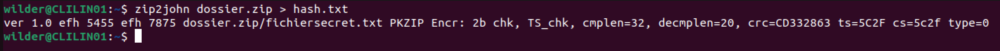

Pour information, ton nouveau fichier ```hash.txt``` devrait ressembler à ceci :
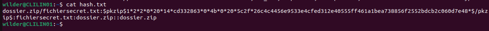

La deuxième étape est de lancer la commande ```john hash.txt ```.
Deux résultats possibles pour cette commande : 
1. Le mot de passe est trouvé rapidement. Il n'est pas assez robuste.
   
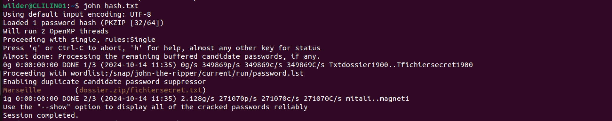
On peut voir dans cet exemple que le mot de passe était Marseille et qu'il a été trouvé en 0 seconde.  

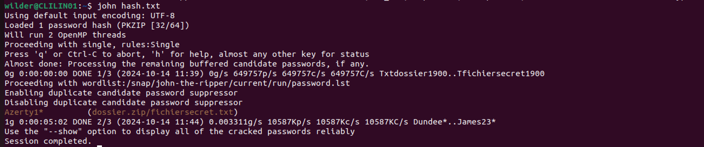
On peut voir dans cet exemple que le mot de passe était Azerty1* et qu'il a été trouvé en 5min02.  

2. La commande tourne. C'est à vous de juger votre seuil de robustesse. Arrêtez la commande avec CTRL+Z quand vous estimerez que le mot de passe est suffisamment résistant. Attention, le temps de recherche dépend de la puissance de votre carte graphique et de votre processeur.  
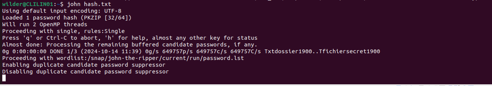  
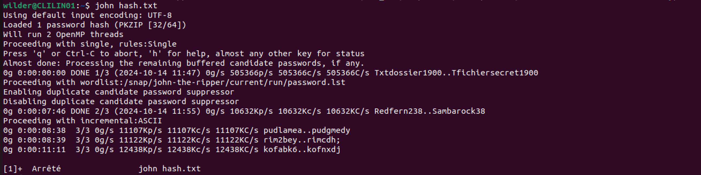   
On peut voir ici que John-the-ripper était en train d'utiliser son dernier mode d'attaque, le mode incrémentiel.  


## Utilisation avancée 

### Options avancées
1. Lancer une attaque uniquement avec le mode simple : ```john --single hash.txt ```  
   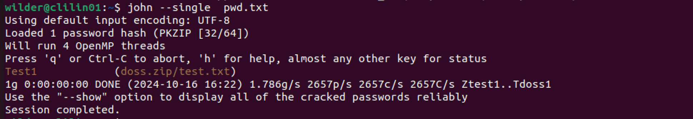

2. Lancer une attaque uniquement avec le mode dictionnaire : ```john -w hash.txt ```  
   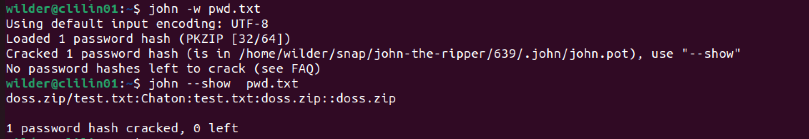
     
3. Lancer un attaque uniquement avec le mode dictionnaire et une liste de mots choisie : ```john -w=/PATH/LISTE hash.txt```  
   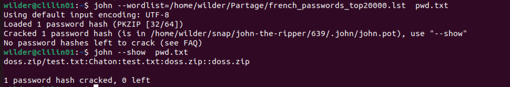
     
4. Voir le mot de passe trouvé : ```john --show hash.txt```  
   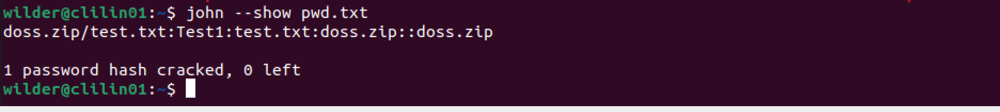
     
5. Déterminer la longueur N du mot de passe à trouver : ```john --length=N hash.txt```  
   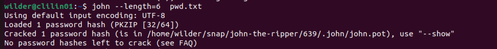
     
6.  Voir l'aide de John-the-ripper : ```john -h```  

### Lancer une attaque contre un compte local

Dans le terminal Linux: 
- créer deux fichiers hash.txt et hash_user.txt : ```touch hash.txt hash_user.txt```  
- changer les droits de ces deux fichiers : ```chmod 700 hash.txt && chmod 700 hash_user.txt```  
- extraire le hash des deux fichiers de la base SAM : ```sudo samdump2 FICHIER_SYSTEM FICHIER_SAM > hash.txt```. Si ces fichiers ne sont pas présents, se référer au [INSTALL.md](https://github.com/WildCodeSchool/TSSR-2409-JAUNE-P1-G3-SecurisationDeMotDePasse/blob/39924a3daeb028b0b27cb2110d2e200526d2d398/INSTALL.md).  
- extraire la ligne du compte à tester grâce à son nom : ```sudo grep $USERNAME hash.txt > hash_user.txt```  
- lancer John sur ce hash : ```john --format=NT hash_user.txt```  
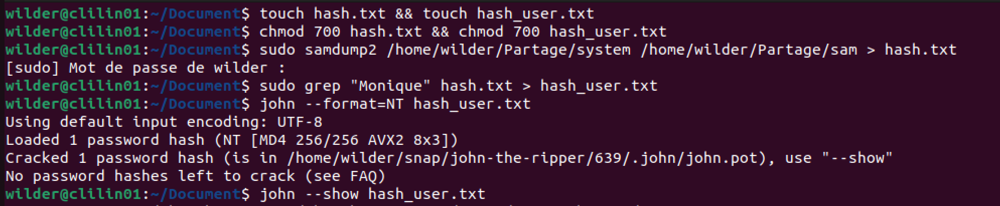  
  

## FAQ
" Quand je lance zip2john, on me dit que ```zip2john not found```. "   
Il faut vérifier que l'alias a bien été créé, se reférer au [INSTALL.md](https://github.com/WildCodeSchool/TSSR-2409-JAUNE-P1-G3-SecurisationDeMotDePasse/blob/39924a3daeb028b0b27cb2110d2e200526d2d398/INSTALL.md).

" Quand je lance zip2john, on me dit que ```hash.txt : no such file or directory found```. "  
Vous devez créer le fichier ```hash.txt```avant de l'utiliser.

" Quand je lance zip2john, on me dit que ```Did not find End of Central Directory```. "  
Avez-vous lancé la bonne commande, avec la redirection ? Si oui, votre dossier zippé est peut être corrompé. Tentez de lancer ```zip -FF dossier.zip --out dossierRepare.zip``` et ```zipZjohn dossierRepare.zip > hash.txt```. Si le même problème subsiste, refaite votre archive.

" Quand je lance John, j'ai ``Ǹo password hashes loaded`` ou ```No password hashes left to crack```."   
Plusieurs raisons possibles :  
- Votre fichier ```hash.txt``` peut être vide ou ne pas contenir de mot de passe.  
- Vous avez peut être déjà décrypté votre fichier.  
- Pour d'autres raisons, rendez-vous sur cette [FAQ](https://www.openwall.com/john/doc/FAQ.shtml).

Pour d'autres questions, vérifiez la [FAQ](https://www.openwall.com/john/doc/FAQ.shtml).

